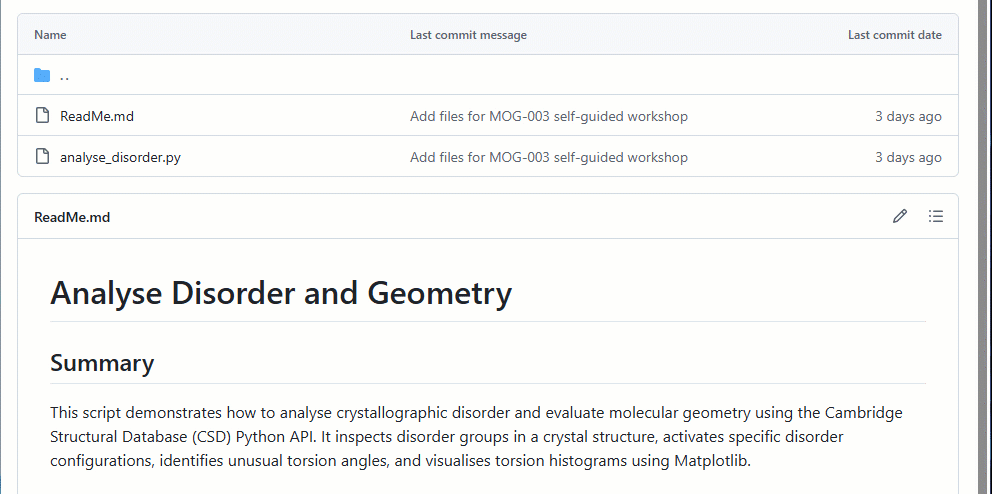

# CSD Python API Tutorials


This repository contains Python scripts for virtual workshops, self-guided workshops, videos and educational tutorials. The scripts leverage the toolkit found within
the [CCDC portfolio](https://www.ccdc.cam.ac.uk/solutions/) that are accessible via
the [CSD Python API](https://www.ccdc.cam.ac.uk/solutions/csd-core/components/csd-python-api/).

The purpose of this platform is to distribute knowledge and allow for scientific collaborations. Scripts are provided on an as-is basis and while their use is not supported we do welcome feedback on potential improvements. All scripts are tested against the latest version of the CSD Python API as installed with the CSD Portfolio.

> For feedback or to report any issues please contact [support@ccdc.cam.ac.uk](mailto:support@ccdc.cam.ac.uk)

## Content 

```graphql
.
├─ assets                  # Images for documentation
├─ scripts                 # Python scripts 
├─ LICENSE
└─ README.md
```

## Licensing Requirements 

Valid CSD Portfolio licence is required for all scripts, some will require additional licence levels for use, such as Discovery and Materials. Requirements are clearly displayed in the `ReadMe` that accompanies each script. 

Don’t have a licence? Contact us [here to request a quote or demonstration.](https://www.ccdc.cam.ac.uk/theccdcprofile/contactus/)

## Downloading Scripts

We advise that users `fork` the repository to ensure they can keep up to date with any modification.
If you don't want to worry about having a GitHub account or are not confident with Git, you can download the scripts straight from this webpage. 

The following section will outline how to download multiple or individual scripts: 

### 1. Downloading All Scripts in a Zip file 

Whilst in the main repository window click `Code` and select `Download Zip`:


### 2. Downloading Individual Scripts

Once you've found a script/file you wish to download, click on it. This will show you the content of the file. In the top right of the file click on the download button. 
This will open a file explorer. Click `"Save As..."` to save the script. 



## Running scripts through the CSD Python API Miniconda installed 
This requires you to already have the CSD Python API installed. Activate the environment as described in
[this FAQ on activating the CSD Python API](https://www.ccdc.cam.ac.uk/support-and-resources/support/case/?caseid=6c3ec918-aede-ed11-96a2-00505695c114) then run

```cmd
python script_example.py
```

in the same command prompt / terminal window.
